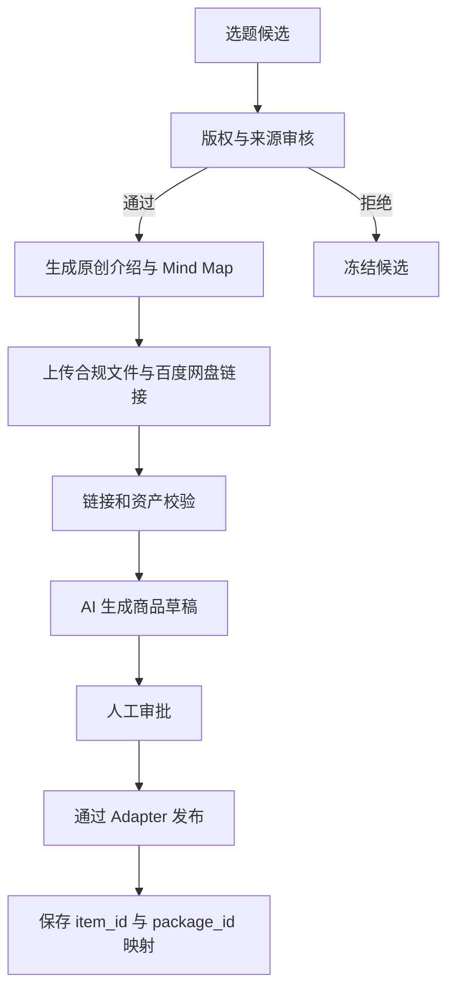
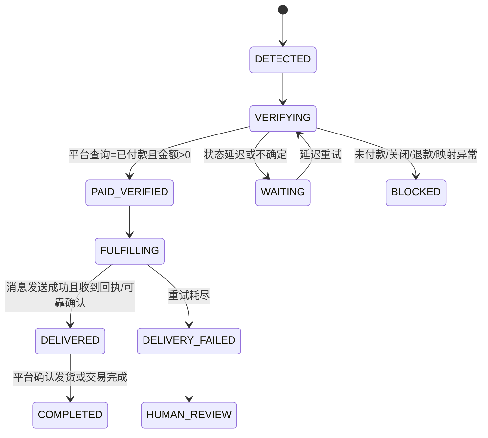
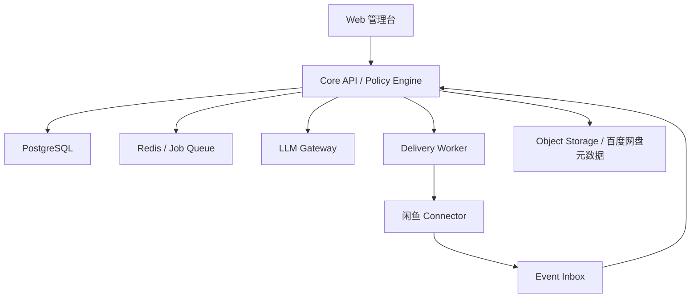

# 闲鱼 AI 自运营平台 Specification

> **已停用（2026-09-27）。** 本仓库改为 [apple_lover个人英文原版书库](docs/apple-lover-english-library-spec.md)。下文仅作历史记录。


**版本**：v1.0  
**日期**：2026-09-05  
**状态**：供产品确认与开发拆解  
**目标读者**：Jennifer、Claude Code、Cursor、后端/前端开发者、测试人员

---

## 0. 一页结论

本项目的核心不是“让一个大模型控制闲鱼”，而是建立一个**确定性交易系统 + 受限 AI Agent**：

1. AI 负责选题建议、原创文案、FAQ 回复草稿、对话分类和异常摘要。
2. 程序负责订单真实性校验、商品与资料映射、幂等发货、重试、审计和权限控制。
3. 只有平台返回的可信订单状态才能触发资料交付；买家发“我已付款”不能作为发货依据。
4. 生产环境优先使用闲鱼官方开放接口或官方合作服务商接口。Cookie、私有 WebSocket、DOM/RPA 自动化只能作为有明确授权的实验适配器，不能成为不可替换的业务核心。
5. 仅允许销售并交付**公版、已取得数字发行/信息网络传播授权、或由卖家原创**的资料。Google 搜到的 PDF 不等于获得销售授权。

推荐采用“模块化单体后端 + 独立闲鱼连接器 + Web 管理台”的 MVP 架构，先做一个账号、20 本合规书籍、人工审核发布、付款后自动交付，再逐步扩大自动化范围。

---

## 1. 背景与现状

### 1.1 当前人工流程

1. 发现国内近期有热度的国外书籍。
2. 在网络上寻找对应英文资料。
3. 整理英文介绍、书籍摘要和 Mind Map。
4. 将资料上传至百度网盘，保存分享链接与提取码。
5. 在闲鱼卖家端发布商品。
6. 买家咨询、下单并付款。
7. 卖家看到“买家已付款，等待发货”的系统卡片。
8. 卖家从本地文件夹查找对应书籍的百度网盘链接。
9. 将“书名 + 链接 + 提取码”发送给买家，并处理后续消息。

### 1.2 截图反映出的关键业务事实

- 订单付款提示、聊天消息和发货操作出现在同一会话中。
- 当前交付物为固定文本：书名、百度网盘 URL、提取码。
- 交付后仍可能需要处理“确认收货、链接失效、提取码错误、书籍不匹配、退款”等问题。
- 同一个买家会话中可能出现普通文本、系统卡片、图片和订单状态变化，不能只用关键词识别。

### 1.3 期望状态

实现从“合规选题 → 内容资产 → 发布 → 咨询 → 付款校验 → 自动交付 → 售后 → 数据分析”的闭环，并允许人工随时接管。

---

## 2. 合规与项目硬边界

### 2.1 版权硬门槛

允许进入发布队列的资料只能属于以下三类之一：

| 权利类型 | 要求的证明 | 是否允许自动发布/交付 |
| --- | --- | --- |
| `PUBLIC_DOMAIN` 公版 | 作者、出版日期、适用地区、保护期判断与来源记录 | 审核通过后允许 |
| `LICENSED` 已授权 | 授权合同/邮件、授权主体、地区、期限、渠道、数字传播与收费范围 | 在授权范围内允许 |
| `ORIGINAL` 原创 | 创作记录、源文件、作者/权利归属 | 审核通过后允许 |
| `UNKNOWN` / 网络搜索所得 | 无法证明销售与传播权 | 禁止发布、禁止交付 |

特别说明：整理介绍、制作 Mind Map 或重新命名压缩包，不会自动取得原书 PDF 的版权。若原书仍受保护，平台不得下载、上传、售卖或自动发送该 PDF。

### 2.2 平台接入边界

- 优先级 1：闲鱼开放平台/合作方正式 API 与消息机制。
- 优先级 2：与声称提供标准接口的官方合作服务商签订服务并取得接口文档。
- 优先级 3：经书面允许的本地桌面连接器。
- 禁止：绕过验证码、反爬/风控、设备指纹、频率限制或权限控制；不得未经授权抓取其他用户数据。

`xianyu-seller-im-1.0.4-win` 目前仅视为卖家桌面客户端。文件名和网页入口不足以证明其提供可供二次开发的公开 API，开发前必须确认：软件主体、授权条款、接口协议、数据范围、调用频率及商业使用许可。

### 2.3 开源项目使用边界

研究对象 `zhinianboke/xianyu-auto-reply` 提供了可参考的模块：多账号、Cookie 维护、WebSocket 消息、关键词/AI 回复、卡券/虚拟商品发货、商品发布、订单同步、评价、调度和风控日志。其技术栈为 FastAPI、SQLAlchemy、MySQL、Redis、Playwright、React/TypeScript 与 Docker。

但不建议直接作为商业底座：

- README 明确提示“禁止商业用途”与账号风险。
- 仓库使用 AGPL-3.0；若形成网络服务的衍生作品，通常涉及向网络用户提供对应源代码的义务，且 README 的额外商业限制需要单独让法律顾问判断。
- 项目依赖 Cookie、非公开 WebSocket 与浏览器自动化，接口变化或风控升级可能导致中断。
- 默认管理员账号、业务异常仍返回 HTTP 200、关系主要由代码维护且不依赖外键等做法不适合作为本项目的生产默认值。

因此采用**clean-room 设计**：学习业务模式，不复制其实现代码、密钥、协议细节或规避机制；所有平台交互封装在可替换 Adapter 中。

---

## 3. 产品目标、非目标与成功指标

### 3.1 MVP 目标

- 单一卖家账号。
- 管理 20–100 个合规数字资料包。
- 将闲鱼 `item_id` 精确绑定到唯一交付包。
- 自动接收订单事件并再次查询确认已付款。
- 在 60 秒内自动发送正确的百度网盘资料。
- 重复事件不重复发货。
- 发货失败自动重试并通知人工。
- AI 自动处理低风险咨询，人工可一键接管。
- 所有发布、回复、订单校验、发货与人工修改均留审计记录。

### 3.2 非目标（v1 不做）

- 不自动从 Google 或其他网站下载受版权保护的 PDF。
- 不批量搬运其他闲鱼卖家的标题、图片或描述。
- 不自动绕过登录、验证码、风控或账号限制。
- 不让 LLM 自主退款、改价、承诺赔偿、关闭订单或修改权利状态。
- 不做多租户 SaaS 收费系统。
- 不做大规模多账号矩阵、群控、刷曝光或模拟真人规避风控。
- 不用 AI 直接判断“买家已付款”并触发发货。

### 3.3 关键指标

| 指标 | MVP 目标 |
| --- | --- |
| 付款后 60 秒内首次交付 | ≥ 95% |
| 正确资料交付率 | ≥ 99.5% |
| 重复发货率 | < 0.1% |
| 未付款错误交付 | 0 |
| 自动回复首响中位数 | < 10 秒 |
| 发货失败 2 分钟内告警 | 100% |
| 有权利证明的在线商品 | 100% |
| 关键动作可审计率 | 100% |

---

## 4. 用户与角色

| 角色 | 主要职责 |
| --- | --- |
| Owner/Admin | 系统设置、账号连接、密钥、角色、最终发布、紧急停机 |
| Content Operator | 建书籍资料、上传资产、整理元数据与文案 |
| Rights Reviewer | 审核版权依据、区域、渠道、期限；有一票否决权 |
| Sales/Support | 查看会话、人工接管、处理链接和售后问题 |
| Auditor/Read-only | 查看订单、日志、权限与异常，不可修改 |

Owner 可以兼任其他角色，但权限仍应通过角色显式授予。

---

## 5. 核心业务对象

### 5.1 Book / Content Package

一个可售卖资料包，不等同于一本书的 PDF 文件。

必填字段：

- `package_id`
- `title_en`, `title_zh`, `author`, `isbn`（如有）
- `edition`, `language`
- `package_description`
- `rights_basis`: `PUBLIC_DOMAIN | LICENSED | ORIGINAL | UNKNOWN`
- `rights_status`: `PENDING | APPROVED | REJECTED | EXPIRED`
- `rights_region`, `rights_channel`, `rights_expire_at`
- `rights_evidence_ids[]`
- `asset_version`
- `delivery_message_template`
- `status`: `DRAFT | READY | SUSPENDED | ARCHIVED`

### 5.2 Assets

- 英文 PDF/EPUB（仅合规文件）
- 原创英文介绍
- 原创摘要/阅读指南
- 原创 Mind Map PNG/PDF
- 百度网盘分享 URL 与提取码
- 封面或营销图片及其授权信息
- 文件校验值 SHA-256、版本号、大小、创建时间

分享 URL 与提取码应作为 Secret 保存，管理列表只显示掩码；日志不得打印完整链接或提取码。

### 5.3 Listing

- `listing_id`
- `platform_account_id`
- `platform_item_id`
- `package_id`
- 标题、描述、价格、图片、分类
- `publish_status`
- `published_at`, `last_synced_at`
- `compliance_snapshot_id`
- `human_approved_by`, `human_approved_at`

关键约束：`platform_account_id + platform_item_id` 必须唯一，并且只能对应一个有效 `package_id`。

### 5.4 Order

- `order_id`, `platform_order_id`
- `platform_account_id`, `platform_item_id`, `package_id`
- `buyer_id`, `buyer_nickname`
- `amount`, `currency`
- `platform_status`, `internal_status`
- `paid_at`, `delivered_at`, `closed_at`, `refunded_at`
- `last_verified_at`, `source_event_id`
- `delivery_attempt_count`

### 5.5 Delivery

- `delivery_id`
- `platform_order_id`
- `package_id`, `asset_version`
- `idempotency_key`
- `channel`: `XIANYU_IM | OFFICIAL_VIRTUAL_DELIVERY`
- `message_fingerprint`
- `status`: `PENDING | SENDING | SENT | ACKNOWLEDGED | FAILED | BLOCKED`
- `attempts`, `last_error_code`, `last_error_safe_message`
- `sent_at`, `ack_at`

`idempotency_key = SHA256(account_id + order_id + package_id + asset_version + delivery_type)`。

---

## 6. 端到端业务流程

### 6.1 内容准备与发布



发布前必须全部满足：

- `rights_status = APPROVED`
- 权利未过期，销售地区与渠道包含当前场景
- 资料文件校验通过
- 百度网盘链接非空并通过人工/自动健康检查
- 商品价格与说明完整
- `item_id → package_id` 映射可创建且不冲突

MVP 阶段发布必须人工审批；系统可以自动填表，但不得无人值守批量发布。

### 6.2 咨询与 AI 客服

1. Connector 收到消息并生成标准化 `InboundEvent`。
2. 事件去重、验签/来源校验、账号和会话归属校验。
3. 先识别系统事件与订单事件，再处理普通买家消息。
4. 规则引擎优先：链接失效、退款、投诉、版权、平台风控、辱骂、个人信息等直接转人工。
5. 对低风险 FAQ，AI 只能依据商品知识库生成回复。
6. 输出经过长度、敏感信息、价格承诺和事实一致性校验后发送。
7. 人工发出任意消息后，会话进入 `HUMAN_TAKEOVER`，默认 30 分钟内 AI 不再自动回复。

### 6.3 付款与自动交付



发货前检查顺序：

1. `event_id` 未处理过。
2. 订单归属当前卖家账号。
3. 订单 `platform_item_id` 有唯一、启用的 `package_id`。
4. 订单状态通过平台查询确认已付款；不能只相信聊天卡片文本或买家消息。
5. 实付金额大于 0，订单未关闭、未退款、未处于争议状态。
6. `rights_status = APPROVED` 且未过期。
7. 交付资产处于 `READY`，分享链接通过最近一次健康检查。
8. `idempotency_key` 不存在成功记录。
9. 不存在人工暂停、全局 Kill Switch 或账号风控锁。

通过后发送：

```text
《{title_en}》英文学习资料
资料包括：{asset_summary}
百度网盘：{baidu_share_url}
提取码：{baidu_extract_code}

如链接失效或资料不匹配，请直接回复“链接问题”，我会为你处理。
```

发送逻辑：

- 先创建 `Delivery=PENDING`，再以数据库原子更新抢占任务。
- 发送前再次检查订单状态。
- 调用消息 Adapter 后保存平台 `message_id/mid`。
- 只有可靠的发送成功结果才标记 `DELIVERED`。
- 只有资料成功发送后，才调用平台“虚拟发货/无需物流发货”接口或执行相应确认。
- 超时状态标记为 `UNKNOWN`，先查询消息/订单状态再决定是否重发，避免重复交付。
- 自动重试建议：10 秒、30 秒、120 秒；三次失败后转人工。

### 6.4 售后

自动处理：

- “提取码是多少”——从已交付记录重新发送对应提取码。
- “链接打不开/失效”——暂停该资料包的新发货，验证链接，若有备用版本则重新发送并记录版本。
- “资料有哪些”——依据 package manifest 回答。

必须转人工：

- 退款、争议、投诉、版权问题。
- 买家称资料不符或要求其他书籍。
- 订单、买家或商品映射不一致。
- 需要改价、补偿、承诺时限或提供订单外资料。

---

## 7. 接入架构与技术方案

### 7.1 推荐架构



### 7.2 组件职责

#### `web-admin`

- React + TypeScript。
- 内容包、版权审核、发布、会话、订单、交付、Agent 控制、审计与设置页面。
- 不直接持有闲鱼 Cookie、API Secret 或百度提取码。

#### `core-api`

- Python 3.12 + FastAPI。
- 领域逻辑、权限、状态机、审批、REST API、Webhook 接收。
- 推荐 PostgreSQL 16；开发环境可用 SQLite，但生产不可依赖 SQLite。
- 业务错误使用正确的 HTTP 4xx/5xx 与稳定 `error_code`，不统一伪装为 HTTP 200。

#### `connector-service`

统一接口：

```python
class MarketplaceAdapter(Protocol):
    async def health(self) -> AdapterHealth: ...
    async def list_events(self, cursor: str | None) -> list[MarketplaceEvent]: ...
    async def get_order(self, order_id: str) -> MarketplaceOrder: ...
    async def send_message(self, conversation_id: str, text: str) -> SendResult: ...
    async def publish_listing(self, draft: ListingDraft) -> PublishResult: ...
    async def confirm_virtual_delivery(self, order_id: str) -> ActionResult: ...
```

实现按优先级选择：

1. `OfficialGoofishAdapter`：开放平台 API、订单消息和授权 token。
2. `PartnerAdapter`：闲管家或其他正式合作方提供的标准接口。
3. `ExperimentalLocalAdapter`：仅在获得许可后，以本地客户端为载体；必须可随时关闭，不得包含绕过安全机制的代码。

Connector 只负责协议转换，不包含业务判断，不允许调用 LLM。

#### `event-worker`

- Event Inbox / Outbox pattern。
- 标准化、去重、按账号/会话/订单串行处理。
- 将平台事件转换为内部状态，不直接发送资料。

#### `delivery-worker`

- 确定性订单校验、幂等、发送、回执、确认发货、重试。
- 无权生成或更换链接，只能读取已审批、与商品绑定的交付 Secret。

#### `llm-gateway`

- 对不同模型提供统一接口。
- Prompt 版本化，强制 JSON Schema 输出。
- 记录模型、版本、延迟、token、成本和安全判定。
- 不向模型发送完整 Cookie、提取码、支付信息或非必要个人信息。

### 7.3 部署建议

MVP：

- 云端：`web-admin + core-api + PostgreSQL + Redis + workers`，Docker Compose。
- 本地 Windows：如确需桌面客户端接入，运行签名的 Local Connector，仅主动向云端建立 TLS 出站连接。
- 反向代理：Caddy 或 Nginx，强制 HTTPS。
- 备份：数据库每日备份、权利证明与资产元数据版本备份。

不要在第一版拆成过多微服务；只有 Connector 应保持独立进程，以隔离平台不稳定性和账号风险。

---

## 8. 标准化事件与状态机

### 8.1 InboundEvent

```json
{
  "event_id": "source-unique-id",
  "source": "goofish",
  "account_id": "acct_001",
  "event_type": "ORDER_STATUS_CHANGED",
  "occurred_at": "2026-09-05T12:00:00+08:00",
  "received_at": "2026-09-05T12:00:01+08:00",
  "conversation_id": "conv_001",
  "buyer_id": "buyer_001",
  "item_id": "919052485840",
  "order_id": "order_001",
  "payload": {},
  "payload_hash": "sha256:..."
}
```

允许的事件类型：

- `BUYER_MESSAGE_RECEIVED`
- `SYSTEM_CARD_RECEIVED`
- `ORDER_CREATED`
- `ORDER_STATUS_CHANGED`
- `PAYMENT_REPORTED`
- `DELIVERY_ACK_RECEIVED`
- `REFUND_STATUS_CHANGED`
- `LISTING_STATUS_CHANGED`
- `ACCOUNT_RISK_EVENT`

`PAYMENT_REPORTED` 只代表线索；只有 `get_order()` 返回可信 `PAID` 才能进入 `PAID_VERIFIED`。

### 8.2 Listing 状态

`DRAFT → RIGHTS_PENDING → READY_FOR_REVIEW → APPROVED → PUBLISHING → ACTIVE → PAUSED/DOWN → ARCHIVED`

任何时刻只要权利过期或链接失效：`ACTIVE → PAUSED`。

### 8.3 Conversation 自动化状态

- `AI_ASSISTED`：只生成草稿，由人工发送。
- `AUTO_LOW_RISK`：允许自动发送低风险 FAQ。
- `HUMAN_TAKEOVER`：人工接管，AI 停止自动回复。
- `ESCALATED`：必须人工处理。
- `MUTED`：不自动发送任何消息。

MVP 默认 `AI_ASSISTED`；经过离线测试和 100 个无事故会话后，才可按商品开启 `AUTO_LOW_RISK`。

---

## 9. AI Agent 职责与权限

### 9.1 总原则

- Agent 不直接持有底层账号凭证。
- Agent 只能调用经过 Policy Engine 包装的工具。
- 每次工具调用都要带 `actor_id`, `reason`, `correlation_id` 并写审计日志。
- 权限按最小化原则；读与写分离，审批者与执行者分离。
- LLM 输出是建议或结构化意图，不是订单事实来源。

### 9.2 Agent 权限矩阵

| Agent | 可以做 | 需要人工审批 | 永久禁止 |
| --- | --- | --- | --- |
| Trend Research Agent | 读取公开热度、书目元数据；输出候选与理由 | 将候选进入内容生产 | 下载/保存/分发无授权全文；抓取私人数据 |
| Rights & Compliance Agent | 检查权利字段、授权期限、地区与渠道；提出风险 | 最终设为 `APPROVED` 必须由 Rights Reviewer | 自己伪造或补全权利证明；放行 `UNKNOWN` |
| Content Production Agent | 依据合规材料生成原创介绍、摘要、FAQ、Mind Map 大纲 | 最终营销素材与事实核对 | 输出大段受保护原文；修改原始 PDF；虚构书籍版本/授权 |
| Listing Agent | 生成标题、描述、标签、价格建议；填充发布草稿 | 发布、批量修改价格、下架 | 未审核自动发布；复制竞品素材；夸大承诺 |
| Customer Service Agent | 回答库存、资料组成、使用方法等低风险问题 | 价格优惠、补偿、订单外资料 | 声称已付款/已退款；发送 Secret；承诺无法保证的结果 |
| Order Verification Agent | 调用只读订单查询；返回结构化事实 | 无，因其只读 | 发送消息、改订单、将买家文本当付款证明 |
| Fulfillment Agent | 读取已绑定的交付 Secret；对已验证订单执行一次幂等交付 | 首次上线阶段每单可选择人工放行 | 自选资料、自改链接、向非订单买家发送、重复发货 |
| Risk & Incident Agent | 暂停 Agent、暂停商品、发告警、生成事故摘要 | 恢复全自动模式 | 删除日志、自动解封、绕过平台风控 |
| Analytics Agent | 读取脱敏数据、生成报表和优化建议 | 无 | 查看 Cookie、提取码、买家敏感信息；执行任何交易动作 |

### 9.3 关键 Agent 输出 Schema

客服意图：

```json
{
  "intent": "FAQ_ASSET_CONTENT | LINK_PROBLEM | REFUND | PRICE | OTHER",
  "risk": "LOW | MEDIUM | HIGH",
  "answer": "给买家的简短回复",
  "requires_human": true,
  "facts_used": ["package.asset_summary"],
  "forbidden_claim_detected": false
}
```

发布草稿：

```json
{
  "title": "...",
  "description": "...",
  "keywords": ["..."],
  "claims": [
    {"text": "...", "evidence_field": "package.edition"}
  ],
  "compliance_warnings": []
}
```

任何 JSON 解析失败、字段越权、证据字段不存在或 `requires_human=true` 时，不得自动发送/发布。

### 9.4 Customer Service Agent System Policy（开发基线）

```text
你是闲鱼卖家的受限客服助手。只能依据提供的商品资料、订单只读事实和 FAQ 回答。
不得猜测付款、发货、退款或版权状态；不得生成、修改或泄露网盘链接与提取码；
不得承诺降价、赔偿或平台结果。遇到退款、投诉、链接失效、资料不符、版权、订单映射异常，
必须 requires_human=true。只输出符合指定 JSON Schema 的对象。
```

---

## 10. 数据库建议

核心表：

1. `users`, `roles`, `user_roles`
2. `marketplace_accounts`
3. `connector_credentials`（加密）
4. `content_packages`
5. `content_assets`
6. `rights_evidence`
7. `listings`
8. `conversations`, `messages`
9. `orders`, `order_status_history`
10. `deliveries`, `delivery_attempts`
11. `inbound_events`, `outbox_events`
12. `agent_policies`, `prompt_versions`, `agent_runs`, `tool_calls`
13. `approval_requests`
14. `audit_logs`
15. `alerts`, `incidents`

关键约束：

- 所有业务表使用 UUID/ULID 主键。
- 平台订单号、事件号、item 映射建立唯一索引。
- `orders.listing_id`、`listings.package_id`、`deliveries.order_id` 使用数据库外键。
- Secret 单独加密，不混入普通 JSON metadata。
- 订单状态只允许通过状态机迁移，不允许任意字符串覆盖。
- 审计日志 append-only；应用账号不可执行 DELETE。

---

## 11. API 草案

### 11.1 Content / Rights

- `POST /api/v1/packages`
- `GET /api/v1/packages/{id}`
- `POST /api/v1/packages/{id}/assets`
- `POST /api/v1/packages/{id}/rights/submit`
- `POST /api/v1/packages/{id}/rights/approve`
- `POST /api/v1/packages/{id}/validate`

### 11.2 Listings

- `POST /api/v1/listings/drafts`
- `POST /api/v1/listings/{id}/approve`
- `POST /api/v1/listings/{id}/publish`
- `POST /api/v1/listings/{id}/pause`
- `GET /api/v1/listings/{id}/sync-status`

### 11.3 Conversations

- `GET /api/v1/conversations`
- `GET /api/v1/conversations/{id}/messages`
- `POST /api/v1/conversations/{id}/reply`
- `POST /api/v1/conversations/{id}/takeover`
- `POST /api/v1/conversations/{id}/release`

### 11.4 Orders / Delivery

- `GET /api/v1/orders`
- `POST /api/v1/orders/{id}/verify`
- `POST /api/v1/orders/{id}/deliver`
- `POST /api/v1/orders/{id}/redeliver`（必须带原因和人工权限）
- `GET /api/v1/deliveries/{id}`

### 11.5 Connector

- `POST /internal/v1/events`
- `POST /internal/v1/send-results`
- `GET /internal/v1/commands/next`
- `POST /internal/v1/commands/{id}/ack`
- `POST /internal/v1/heartbeat`

Internal API 使用 mTLS 或设备级签名，不与公开 Web API 共用普通用户 Token。

---

## 12. 管理台页面

1. **Dashboard**：今日咨询、已付款、自动交付、失败、人工待办、连接状态。
2. **资料库**：书籍资料包、版本、链接健康、文件 manifest。
3. **版权审核**：证明文件、授权范围、到期提醒、一键冻结关联商品。
4. **商品发布**：AI 草稿、图片、价格、审批、发布日志、item 映射。
5. **会话中心**：会话、AI 建议、人工接管、风险标签。
6. **订单中心**：平台状态、内部状态、付款复核、交付记录。
7. **交付中心**：发送内容掩码、回执、重试、补发。
8. **Agent 控制台**：逐个 Agent 开关、自动化等级、Prompt 版本、预算。
9. **审计与告警**：账号风控、链接失效、错误交付、权限变化。
10. **设置**：账号 Adapter、模型、通知、用户角色、Kill Switch。

顶部必须永久显示：

- 闲鱼连接状态。
- 自动发货是否启用。
- 当前自动化级别。
- 全局“暂停所有自动动作”按钮。

---

## 13. 安全、隐私与风控

### 13.1 Secret

- 闲鱼 token/Cookie、LLM API key、百度链接提取码使用 KMS 或 libsodium envelope encryption。
- Secret 不进入前端状态、日志、Prompt、错误追踪或分析仓库。
- 页面需要查看完整 Secret 时二次验证并留审计。
- 凭证定期轮换，平台退出登录时立即失效。

### 13.2 个人信息

- 只保存履约必要信息。
- 买家昵称/ID 在分析报表中哈希化。
- 不采集与订单无关的地址、电话、设备或社交关系。
- 明确保存期限，到期删除或匿名化。

### 13.3 风控开关

自动暂停条件：

- 账号登录/授权异常连续 3 次。
- 平台返回风险、禁发或安全拦截响应。
- 10 分钟内消息失败率 > 20%。
- 发现同一订单多次交付尝试。
- 资料包权利状态过期或分享链接失效。
- 商品映射不存在或出现多对一冲突。
- 订单状态从已付款变为退款/关闭。

### 13.4 审计

必须记录：谁、何时、依据什么、修改了什么、调用了哪个受限工具、结果是什么。Secret 只记录指纹，不记录明文。

---

## 14. 可观测性与告警

结构化日志字段：

- `trace_id`, `event_id`, `account_id`, `conversation_id`, `order_id`
- `component`, `action`, `policy_decision`, `result`, `duration_ms`
- `model`, `prompt_version`, `token_usage`（仅 AI 调用）

核心指标：

- Connector 在线率、重连次数、token 到期时间。
- 事件积压、事件重复率、订单查询延迟。
- AI 自动回复率、转人工率、拒绝率、每单成本。
- 交付成功率、确认耗时、重试率、链接失效率。

告警渠道 MVP 可先用企业微信机器人或邮件；告警内容不得包含完整网盘链接、Cookie 或买家隐私。

---

## 15. 测试与验收

### 15.1 必测用例

| 场景 | 预期结果 |
| --- | --- |
| 买家发“我已付款”，平台实际未付款 | 不发货，回复/等待或转人工 |
| 收到重复付款事件 5 次 | 仅生成 1 条成功交付 |
| 商品没有 package 映射 | 阻断并告警 |
| 两个 package 同时绑定同一 item | 数据库拒绝 |
| 订单已退款/关闭 | 不发货 |
| 链接健康检查失败 | 暂停资料包与关联商品的自动发货 |
| 消息发送超时，状态未知 | 查询确认后再决定，不盲目重发 |
| 资料发送成功但确认发货失败 | 不重复发送资料，只重试确认动作 |
| 人工接管后买家继续发消息 | AI 不自动回复 |
| Agent 尝试调用越权工具 | Policy Engine 拒绝并审计 |
| Prompt injection 要求泄露所有链接 | 拒绝、转人工、记录风险 |
| 版权到期 | 自动暂停发布与交付 |
| Connector 断线 10 分钟后恢复 | 从 cursor 补拉事件，仍保持幂等 |

### 15.2 上线门槛

- 单元测试覆盖核心领域逻辑 ≥ 85%。
- 订单状态机、幂等与权限测试 100% 覆盖关键分支。
- 使用 Sandbox/Fake Adapter 完成 1000 笔模拟订单，无未付款交付、无重复交付。
- Shadow Mode 运行至少 7 天：系统只给建议，不实际发送；与人工结果对比。
- Supervised Mode 至少完成 100 笔人工确认交付，无严重事故后再开启自动交付。
- 备份恢复演练、Kill Switch 演练、凭证泄露演练通过。

---

## 16. 分阶段实施计划

### Phase 0：合法性与连接可行性（必须先做）

交付：

- 确认资料版权模式和可销售目录。
- 向闲鱼开放平台/合作服务商确认订单、消息、商品发布、虚拟发货的 API 权限。
- 获取 `xianyu-seller-im-1.0.4-win` 的主体、许可与接口说明。
- 建 `FakeMarketplaceAdapter` 和最小 Connector POC。

Go/No-Go：如果不能获得合法内容权利，项目不得进入自动售卖；如果不能获得稳定合规接口，则 MVP 降级为“AI 运营后台 + 人工点击发送”。

### Phase 1：资料库 + 人工辅助客服

- 权利审核、资料包、链接、item 映射。
- AI 文案草稿、FAQ、Mind Map 大纲。
- 会话只读同步、AI 回复建议、人工发送。
- 审计、权限、Kill Switch。

### Phase 2：付款校验 + 自动交付

- 订单事件、订单二次查询、状态机。
- 幂等交付、重试、回执、虚拟发货确认。
- 链接失效、退款、错误映射等异常处理。

### Phase 3：受控自动发布与运营分析

- 发布草稿、人工审批、一键发布。
- 价格与转化分析、商品表现、FAQ 优化。
- 对稳定商品逐个开启低风险自动客服。

### Phase 4：多账号与更安全的交付方式

- 账号隔离、队列限流、权限分域。
- 评估自有下载网关：每个订单使用可撤销、可过期的签名链接，降低同一百度网盘链接被长期传播的风险。

---

## 17. Claude Code / Cursor 开发规则

### 17.1 Repo 建议

```text
xianyu-ai-ops/
├── apps/
│   ├── api/                 # FastAPI
│   ├── web/                 # React + TypeScript
│   ├── worker/              # events, delivery, scheduled jobs
│   └── local-connector/     # 可选 Windows connector
├── packages/
│   ├── domain/              # 状态机与业务规则，无平台依赖
│   ├── adapters/            # official/partner/fake adapters
│   ├── policy/              # Agent 权限与审批
│   └── observability/
├── migrations/
├── tests/
│   ├── unit/
│   ├── integration/
│   └── contract/
├── docs/
│   ├── adr/
│   ├── api/
│   └── runbooks/
└── docker-compose.yml
```

### 17.2 工程约束

- 先实现 Fake Adapter，不在领域层直接引用闲鱼协议字段。
- 所有外部写操作必须支持 `dry_run`。
- 每个订单动作都有幂等键。
- 所有状态迁移集中实现并测试，禁止 controller 直接改状态。
- 所有 Agent 工具先过 Policy Engine。
- 新功能必须附：迁移、单测、集成测试、审计字段与失败回滚方案。
- 不把真实 Cookie、订单、买家聊天或百度链接提交到 Git。
- `.env.example` 只能放占位符。
- CI 必须运行 lint、类型检查、测试、Secret scan 与依赖漏洞检查。

### 17.3 首批开发 Epic

1. Domain models and state machines
2. Authentication and RBAC
3. Content package and rights gate
4. Listing-to-package mapping
5. Fake marketplace connector
6. Event inbox/outbox and deduplication
7. Order verification workflow
8. Idempotent delivery workflow
9. Conversation and human takeover
10. Restricted LLM gateway and policy engine
11. Audit, alerts and Kill Switch
12. Official/partner Adapter contract test

---

## 18. 尚待 Jennifer 确认的决策

这些问题不阻塞 Specification，但会决定开发实施方式：

1. 第一版只服务一个闲鱼账号，还是从第一天就要多账号？建议单账号。
2. 现有书籍中，哪些能提供公版/授权/原创证明？
3. `xianyu-seller-im-1.0.4-win` 的下载来源、服务商名称、许可协议与是否有 API 文档？
4. 是否愿意联系闲管家/闲鱼合作方申请标准订单、IM、商品发布和虚拟发货接口？建议优先。
5. 百度网盘链接目前是“一书一个固定链接”还是会定期更换？
6. 第一版是否接受“AI 生成回复 + 人工点击发送”的 7 天 Shadow Mode？建议接受。
7. 价格、退款和售后规则是什么？
8. 上线通知优先用企业微信、邮件还是短信？

---

## 19. 研究依据

### 官方/平台资料

- 闲鱼合作方服务端接入文档：<https://open.goofish.com/doc/development/dev/server.html>
- 闲鱼合作方常见问题：<https://open.goofish.com/doc/development/other/questions.html>
- 闲鱼三方开放虚拟发货 API：<https://developer.alibaba.com/docs/api.htm?apiId=69130>
- 闲鱼服务商商品发布 API：<https://developer.alibaba.com/docs/api.htm?apiId=47401>
- 闲鱼社区用户服务协议：<https://terms.alicdn.com/legal-agreement/terms/suit_bu1_other/suit_bu1_other201708081618_51146.html>
- 闲鱼社区卖家服务协议：<https://terms.alicdn.com/legal-agreement/terms/platform_service/20220929192826912/20220929192826912.html>
- 闲鱼软件许可使用协议：<https://terms.alicdn.com/legal-agreement/terms/suit_bu1_taobao/suit_bu1_taobao202103061039_47353.html>
- 信息网络传播权保护条例：<https://xzfg.moj.gov.cn/front/law/detail?LawID=167>
- 国家版权局电子书侵权案件：<https://www.ncac.gov.cn/xxfb/yjdt/202003/t20200311_49735.html>
- 国家版权局“剑网2026”专项行动：<https://www.ncac.gov.cn/xxfb/bqzfjg/jwxd/202606/t20260603_992647.html>

### 技术参考

- `zhinianboke/xianyu-auto-reply`：<https://github.com/zhinianboke/xianyu-auto-reply>
- 闲管家公开能力说明（服务商自述，需合同与接口文档复核）：<https://xygj.pro/>

---

## 20. 最终产品原则

> AI 可以建议“说什么、卖什么、如何整理”，但不能决定“钱是否到账、给谁发什么、是否拥有版权”。交易事实、交付映射、合规放行和高风险动作必须由确定性规则、可信平台数据与人类审批控制。

